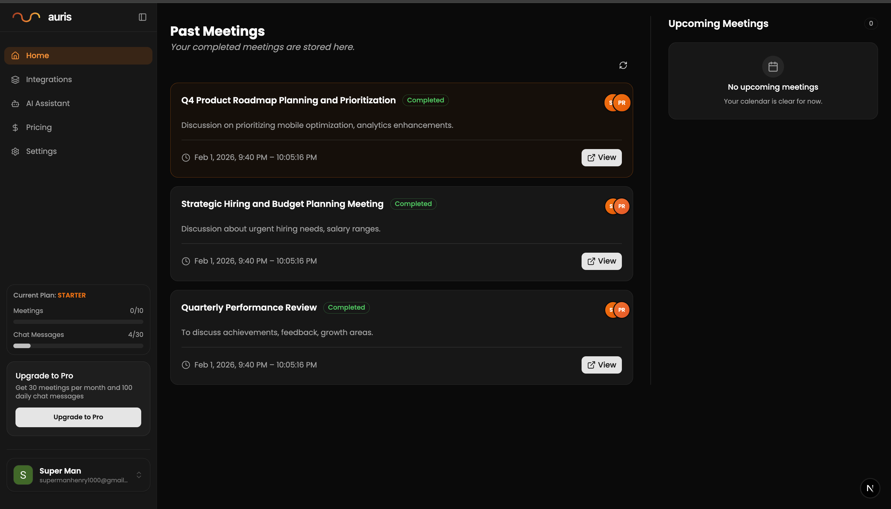
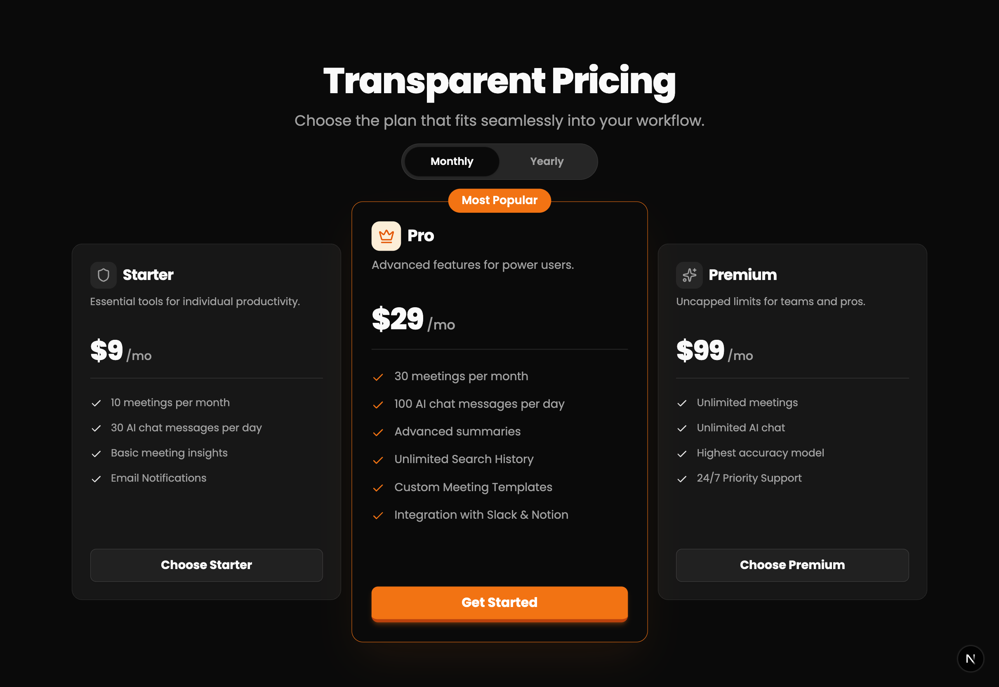
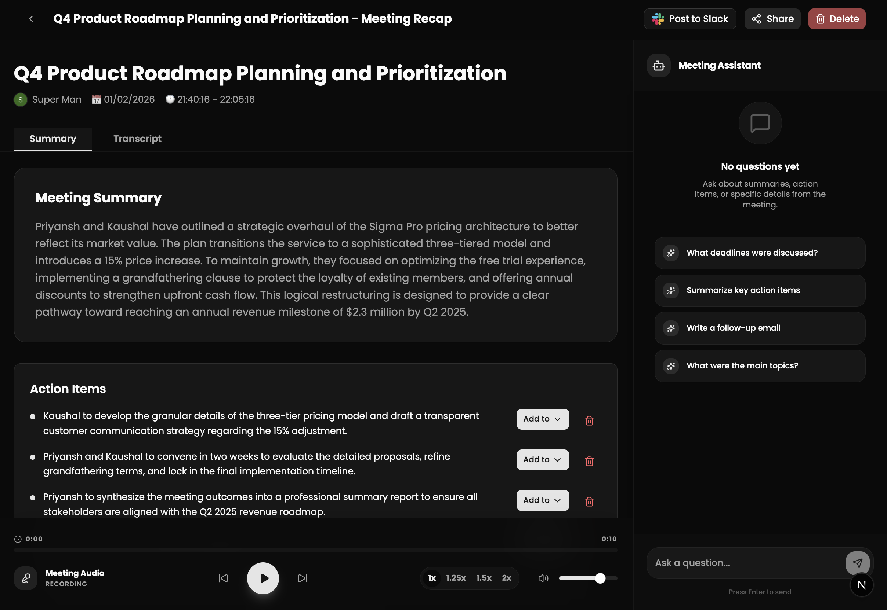
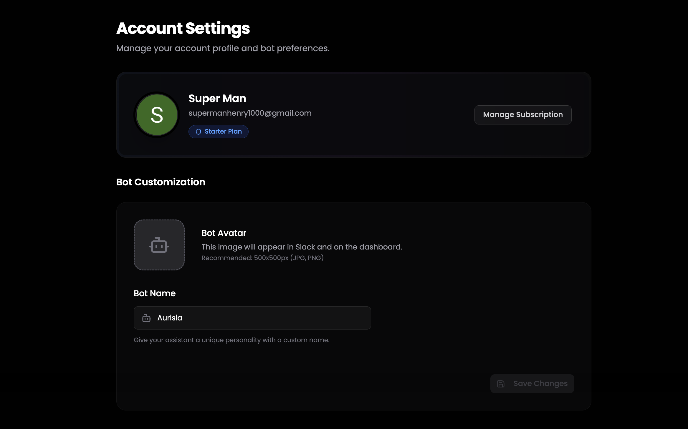

# Auris - Your Intelligent Meeting Assistant

**Auris** is a next-generation AI-powered meeting assistant designed to streamline your workflow by automating meeting documentation, integrating with your favorite tools, and providing intelligent insights. It doesn't just record meetings; it understands them.

Connect your calendar, let Auris join your calls, and get instant summaries, action items, and the ability to "chat" with your entire meeting history using advanced RAG (Retrieval-Augmented Generation) technology.

---

## Key Features

### Intelligent Meeting Agent
- **Auto-Join & Record**: Automatically syncs with your Google Calendar and joins meetings (Google Meet, Zoom, Teams) to record audio and video.
- **Real-time Transcription**: High-accuracy transcription with speaker diarization to know who said what.
- **Smart Summaries**: AI-generated summaries that capture the essence of the discussion, not just the transcript.
- **Action Item Extraction**: Automatically identifies and lists tasks, assignees, and deadlines.

### RAG-Powered Chat (Talk to Your Data)
- **Universal Search**: Ask questions like *"What did we decide about the marketing budget last week?"* and get answers based on your meeting history.
- **Vector Database**: Uses Pinecone to store and index meeting transcripts for semantic search.
- **Contextual Awareness**: The AI understands the context of previous meetings to provide relevant answers.

## Integrations Ecosystem

Auris acts as the central intelligence layer between your meetings and your daily workflow tools.

### Project Management

Auris creates a bridge between conversation and execution. It supports two-way syncing with the industry's leading project management platforms.

#### **Atlassian Jira**
- **Ticket Creation**: Automatically convert action items identified in meetings into Jira issues with proper types (Task, Bug, Story).
- **Smart Context**: When a Jira ticket is created from a meeting, Auris attaches a link to the specific timestamp in the recording where that task was discussed.
- **Sprint Alignment**: Assign tasks directly to active sprints based on meeting context.

#### **Trello**
- **Card Generation**: Turn meeting takeaways into Trello cards instantly.
- **Checklists**: If a meeting results in a multi-step process, Auris populates the Trello card with a detailed checklist of sub-tasks.
- **Labels & Members**: Automatically tag calls with relevant labels (e.g., "Urgent", "Marketing") and assign members based on who was spoken to in the meeting.

#### **Asana**
- **Task & Subtask Sync**: seamless hierarchy mapping; high-level decisions become Projects or Parent Tasks, while specific actions become Subtasks.
- **Due Dates**: When a date is mentioned in the meeting (e.g., "Let's have this done by Friday"), Auris automatically sets the due date in Asana.
- **Project Routing**: Configure rules to send Engineering tasks to one project and Sales tasks to another automatically.

### Team Communication

#### **Slack**
- **Real-time Notifications**: Receive instant summaries as soon as a meeting ends.
- **Interactive Assistant**: Use the `/auris` slash command to query your meeting database directly from Slack.
- **Channel Routing**: Automatically route meeting notes to specific channels based on the meeting title (e.g., "Design Standup" notes go to `#design-team`).

### Calendar Integration
- **Google Calendar**: Full two-way synchronization. Auris reads your invite list to identify participants and updates the calendar event description with the meeting summary and recording link after the call.

### Customizable & Personal
- **Custom Bot Identity**: Name your assistant and give it a custom avatar to fit your company culture.
- **Privacy First**: Enterprise-grade security with granular permissions.

### Flexible Pricing
- **Tiered Plans**: Free, Starter, Pro, and Premium plans to suit individuals and large teams.
- **Billing**: Monthly and Yearly billing options with Stripe integration (Save ~17% on yearly plans).

---

## Technology Stack

Auris is built with a modern, scalable, and type-safe stack:

- **Frontend**: [Next.js 16](https://nextjs.org/) (App Router), [React 19](https://react.dev/)
- **Styling**: [Tailwind CSS v4](https://tailwindcss.com/), [Shadcn/UI](https://ui.shadcn.com/), [Framer Motion](https://www.framer.com/motion/)
- **Backend**: Next.js Server Actions & API Routes
- **Database**: [PostgreSQL](https://www.postgresql.org/) (via [Neon](https://neon.tech/)), [Prisma ORM](https://www.prisma.io/)
- **Authentication**: [Clerk](https://clerk.com/)
- **Payments**: [Stripe](https://stripe.com/)
- **AI & ML**: 
  - [Google Gemini](https://deepmind.google/technologies/gemini/) (LLM for Summaries & Chat)
  - [Pinecone](https://www.pinecone.io/) (Vector Database for RAG)
- **Real-time**: [Slack Bolt](https://slack.dev/bolt-js/) (Slack Bot Events), WebSockets

---

## Screenshots

| Dashboard | Pricing Page |
|:---:|:---:|
|  |  |

| Meeting Insights | Settings |
|:---:|:---:|
|  |  |

---

## Getting Started

Follow these steps to set up Auris locally on your machine.

### Prerequisites
- Node.js (v20+)
- npm or yarn
- PostgreSQL Database
- Clerk Account
- Stripe Account
- Google Cloud Project (for Gemini & Calendar API)
- Pinecone Account

### 1. Clone the Repository
```bash
git clone https://github.com/yourusername/auris.git
cd auris
```

### 2. Install Dependencies
```bash
npm install
```

### 3. Environment Variables
Create a `.env` file in the root directory and populate it with your keys:

```bash
# Database (Neon/Postgres)
DATABASE_URL="postgresql://..."

# Auth (Clerk)
NEXT_PUBLIC_CLERK_PUBLISHABLE_KEY="pk_test_..."
CLERK_SECRET_KEY="sk_test_..."

# Payments (Stripe)
STRIPE_SECRET_KEY="sk_test_..."
NEXT_PUBLIC_STRIPE_PUBLISHABLE_KEY="pk_test_..."
STRIPE_WEBHOOK_SECRET="whsec_..."

# AI (Google Gemini & Pinecone)
GEMINI_API_KEY="AIza..."
PINECONE_API_KEY="..."
PINECONE_INDEX="..."

# AWS S3 (For storing avatars/recordings)
AWS_ACCESS_KEY_ID="..."
AWS_SECRET_ACCESS_KEY="..."
AWS_REGION="..."
AWS_BUCKET_NAME="..."

# App URL
NEXT_PUBLIC_APP_URL="http://localhost:3000"
```

### 4. Database Setup
Push the schema to your database:
```bash
npx prisma generate
npx prisma db push
```

### 5. Run the Application
```bash
npm run dev
```
Open [http://localhost:3000](http://localhost:3000) to see the app.

---

## Project Structure

```bash
auris/
├── app/
│   ├── api/             # Backend API routes (Stripe, Slack, RAG, etc.)
│   ├── (auth)/          # Authentication pages (Sign in/up)
│   ├── dashboard/       # Main user dashboard
│   ├── meetings/        # Individual meeting views
│   ├── pricing/         # Pricing & Subscription page
│   └── settings/        # User & Bot settings
├── components/          # Reusable UI components (Shadcn)
├── lib/                 # Utility functions (DB, AI, Helpers)
├── prisma/              # Database schema
└── public/              # Static assets
```

---

## Contributing

We welcome contributions! Please see our [Contributing Guidelines](CONTRIBUTING.md) for details on how to submit pull requests, report issues, and request features.


# 10:10